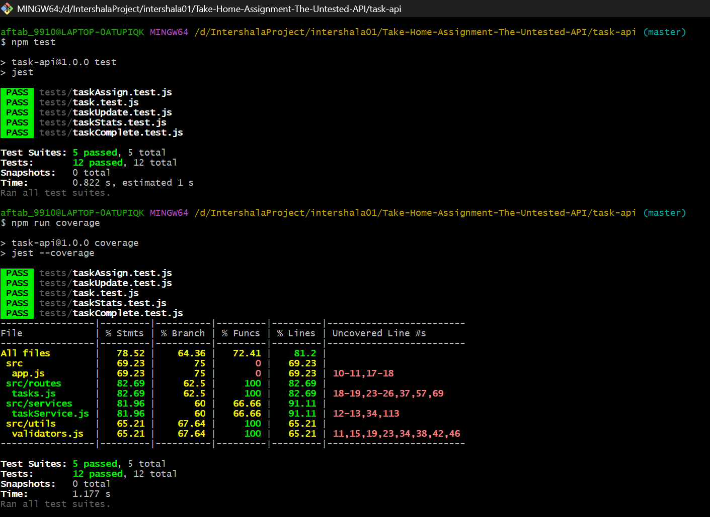

<<<<<<< HEAD
# backendProject01
=======
# Task API

A RESTful API built with Node.js and Express.js for managing tasks.  
This project supports full CRUD operations, task assignment, completion tracking, filtering, pagination, and statistics.

---

## Features

- Create a new task
- Get all tasks
- Update task
- Delete task
- Assign task to user
- Mark task as completed
- Filter tasks by status
- Pagination support
- Task statistics (pending, in-progress, completed, overdue)
- Input validation
- Unit tests with Jest
- Code coverage report

---

## Tech Stack

- Node.js
- Express.js
- Jest (Testing)
- UUID

---

## Project Structure

task-api
│
├── src
│ ├── routes
│ │ └── tasks.js
│ │
│ ├── services
│ │ └── taskService.js
│ │
│ ├── utils
│ │ └── validators.js
│ │
│ └── app.js
│
├── tests
│ ├── task.test.js
│ ├── taskAssign.test.js
│ ├── taskComplete.test.js
│ ├── taskStats.test.js
│ └── taskUpdate.test.js
│
├── package.json
└── README.md

---

## Installation

Clone the repository

git clone https://github.com/yourusername/task-api.git

Go to project folder

cd task-api

Install dependencies

npm install

Start server

npm start

Server runs on:

http://localhost:3000

---

## Run Tests

Run unit tests:

npm test

Generate coverage report:

npm run coverage

---

## API Endpoints

### Create Task

POST /tasks

{
"title": "Learn Node",
"description": "Study Express",
"status": "pending",
"priority": "high",
"dueDate": "2026-04-10"
}

---

### Get All Tasks

GET /tasks

---

### Update Task

PUT /tasks/:id

{
"title": "Updated Task",
"status": "in-progress",
"priority": "medium"
}

---

### Delete Task

DELETE /tasks/:id

---

### Assign Task

PATCH /tasks/:id/assign

{
"userId": "user123"
}

---

### Complete Task

PATCH /tasks/:id/complete

---

### Get Task Stats

GET /tasks/stats

Response example:

{
"pending": 1,
"inProgress": 1,
"completed": 1,
"overdue": 0
}

---

### Filter by Status

GET /tasks?status=pending

---

### Pagination

GET /tasks?page=0&limit=5

---

## Test Coverage

Project includes automated tests using Jest.  
All test cases are passing successfully.

---

## Author

Aftab Ansari  
MCA Student
>>>>>>> 50424ab ( Final Task API with all tests passing)
